<!-- ╔════════════════════════════════════════════════════════════╗
     ║  README de perfil — Eduardo Genes (@eduardogenes)          ║
     ║  Identidade: edugenes_ (papel · tinta · café)              ║
     ╚════════════════════════════════════════════════════════════╝ -->

  

> _Passei quatro anos entre auditorias, hotéis e planilhas antes de escrever código profissionalmente. Foi lá que aprendi o que bootcamp nenhum ensina: a pessoa do outro lado da tela está com pressa — e interface boa é a que respeita isso._

### 01 — Trabalhos

| projeto | | stack | ano |
|---|---|---|---|
| **[W.VIANA Arquitetura](https://wvianaarquitetura.com.br)** | cliente real · no ar | `Next.js` | 2025 |
| **Plataforma de ensino** | edtech multitenant · em produção em colégios pelo Brasil | `Angular` `Node` | 2025–26 |
| **[Garimpeiro Genes](https://github.com/eduardogenes?tab=repositories)** | open source | `React` `TypeScript` | 2025 |
| **[edugenes.dev](https://edugenes.dev)** | portfólio — onde tudo se conecta | `Next.js` | 2026 |

### 02 — Trajetória

### 03 — Caixa de ferramentas

### 04 — Um ano de commits

_Duas fitas do mesmo código — a pessoal e a profissional:_

 

<code>café = pessoal · verde = trabalho — como nas barras do símbolo. Atualizam sozinhas.</code>

### 05 — Contato

_Sem formulário — mensagem boa não merece morrer num inbox de formulário. Me escreve direto:_

**[eduardogenes95@gmail.com](mailto:eduardogenes95@gmail.com)**
&nbsp;·&nbsp; [edugenes.dev](https://edugenes.dev) &nbsp;·&nbsp; [/in/eduardogenes](https://linkedin.com/in/eduardogenes)

 

🇺🇸 <b>English</b>

 

> _I spent four years across audits, hotels and spreadsheets before writing code professionally. That's where I learned what no bootcamp teaches: the person on the other side of the screen is in a hurry — a good interface respects that._

**01 — Work** — [W.VIANA Architecture](https://wvianaarquitetura.com.br) (real client, live), a multitenant education platform in production at schools across Brazil, [Garimpeiro Genes](https://github.com/eduardogenes?tab=repositories) (open source) and [edugenes.dev](https://edugenes.dev).

**02 — Journey** — Full Stack Developer at IMTS Group (2025 →), freelance web developer, and before code: revenue management, fiscal auditing, sales and hospitality. Operations, data and process before code — it became an edge.

**03 — Toolbox** — `React` `TypeScript` `Angular` `Next.js` `Tailwind` `Node` `Python` `MySQL` `Supabase` `AWS` · AWS Cloud Practitioner '25 · graduating Jul 2026 · English C1.

**04 — A year of commits** — two strands of the same code: personal (café) and work (green) — the graphs above update on their own.

**05 — Contact** — **[eduardogenes95@gmail.com](mailto:eduardogenes95@gmail.com)** · [edugenes.dev](https://edugenes.dev) · [/in/eduardogenes](https://linkedin.com/in/eduardogenes)

 

<code>// perfil — rev. 06/2026 · fortaleza, ce · feito à mão, sem template</code>

